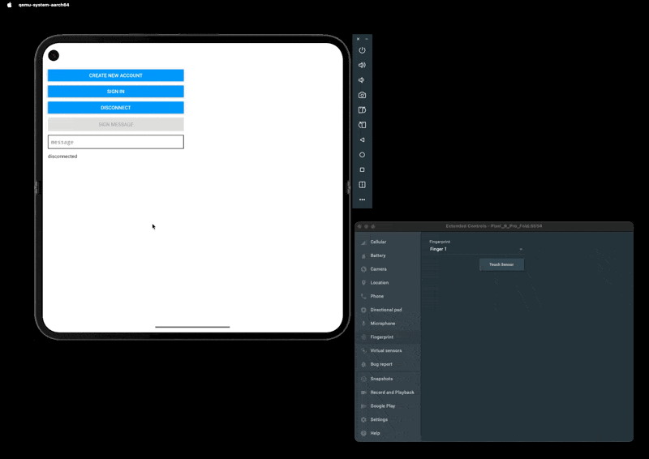

# [Porto](https://porto.sh) x React Native

A Porto React Native template.



## Quick Start

### Prerequisites

- [Node.js](https://nodejs.org) (LTS)
- [Yarn Classic](https://classic.yarnpkg.com) (v1.22+)
- [Expo CLI](https://docs.expo.dev/get-started/installation)
- [EAS CLI](https://docs.expo.dev/build/introduction)
- iOS Requirements:
  - Xcode [I use [xcodes](https://github.com/XcodesOrg/xcodes)]
  - iOS Simulator [I use [xcodes](https://github.com/XcodesOrg/xcodes)]
  - Ruby [I use [mise](https://github.com/jdx/mise)]
  - [fastlame](https://github.com/fastlane/fastlane): `brew install fastlane`
- Android Requirements:
  - Java [I use [sdkman](https://sdkman.io)]
  - Gradle [I use [sdkman](https://sdkman.io)]
  - Android SDK
  - Android Studio

#### Optional, but highly recommended

- [Expo Orbit](https://docs.expo.dev/build/orbit)

### Installation

```bash
gh repo clone ithacaxyz/porto-react-native
cd porto-react-native
yarn install
```

## Development

### Running the App

(1) - Build once as a dev client, then iterate via Metro.

```bash
eas build --platform android --profile development --local
```
  
(2) - Run Android or iOS Expo Start to install the app on your device.

```bash
yarn expo run:android
```

```bash
yarn expo run:ios
```

(3) - Now you can run `start` with `--dev-client` for development.

> [!IMPORTANT]
> Repeat steps (1) and (2) whenever you make changes to `app.config.ts` or to plugins or when you install new dependencies.

```bash
yarn expo start --clear --tunnel --dev-client
```

Press:

- `a` to run on Android. If your physical device is connected, it will automatically select it,
- `shift + a` to view Android options,
- `i` for iOS. Note that passkeys are not supported on iOS Simulator so you need to use an actual device,
- `w` for Web.
s.

When you install / update dependencies, run the following to check dependencies are deduplicated:

```bash
yarn expo install --fix && npx expo-doctor --verbose --yarn
```

### Available Commands (via [just](https://github.com/casey/just))

> [!IMPORTANT]
> You have to build at least once before you can run the app.
> You have to build any time you make changes to `app.config.ts` or to plugins or when you install new dependencies.

- `just build-ios` - Build iOS
- `just build-android` - Build Android

- `just fmt` - Format code with Biome
- `just dev` - Run the app and launch web, android or ios
- `just doctor` - Fix dependencies and run expo doctor
- `just deploy-server` - Deploy server to Railway
- `just android-device` - Mirror Android device screen
- `just android-cert` - Generate Android debug certificate

## Configuration for Forks

When forking this project, update the following fields in `app.config.ts`:

### Required Changes

```typescript
export default (context: ConfigContext): ExpoConfig => ({
  // Update these fields:
  slug: 'your-app-slug',           // Line 8
  name: 'Your App Name',           // Line 9
  scheme: 'your-app-scheme',       // Line 10
  
  ios: {
    appleTeamId: 'YOUR_TEAM_ID',                    // Line 16
    bundleIdentifier: 'com.yourcompany.yourapp',    // Line 17
    associatedDomains: ['webcredentials:your-domain.com'], // Line 18
  },
  android: {
    package: 'com.yourcompany.yourapp',             // Line 21
  },
  extra: {
    eas: {
      projectId: 'your-expo-project-id',            // Line 32
    },
  },
})
```

### Getting Your Values

1. **Apple Team ID**: Found in [Apple Developer Account](https://developer.apple.com/account) → Membership
2. **Bundle Identifier**: Use reverse domain notation (e.g., `com.yourcompany.yourapp`)
3. **EAS Project ID**: Create project at [expo.dev](https://expo.dev) and copy the project ID
4. **Associated Domain**: Your server domain where you'll host the app verification files

## Server Directory (`./server`)

The `./server` directory contains a [Bun](https://bun.sh) server that serves **App Verification Files** required for:

### Purpose

- **Passkey/WebAuthn**: Enables passkey authentication across web and mobile
- **Android App Links**: Verifies your app can handle Android deep links
- **iOS Universal Links**: Verifies your app can handle deep links from your domain

### Files Served

- `/.well-known/apple-app-site-association` - iOS app verification
- `/.well-known/assetlinks.json` - Android app verification

### Deploying the Server

I'm deploying to railway but you can deploy anywhere [./server/index.ts](../server/index.ts) can run.

```bash
just deploy-server
```

## Apple Associated Domains Setup

To enable Universal Links and passkey authentication:

### 1. Update App Configuration

In `app.config.ts`, set your domain:

```typescript
ios: {
  associatedDomains: ['webcredentials:yourdomain.com'],
}
```

### 2. Configure Apple App Site Association

Update `server/apple-app-site-association`:

```json
{
  "webcredentials": {
    "apps": [
      "YOUR_TEAM_ID.your.bundle.identifier"
    ]
  }
}
```

### 3. Configure Android Asset Links

Use `eas credentials` and follow [this guide](https://docs.expo.dev/linking/android-app-links/#create-assetlinksjson-file) and update `server/assetlinks.json`.

### 5. Deploy and Verify

1. Deploy your server with the updated files
2. Verify files are accessible:
   - `https://yourdomain.com/.well-known/apple-app-site-association`
   - `https://yourdomain.com/.well-known/assetlinks.json`
3. Test deep links and passkey functionality

### 6. `app.config.ts` as the Android & iOS Source of Truth

In order to maintain a single source of truth for Android and iOS, we need to strictly follow a few rules

- Make prebuild run every time and codify any native edits as config plugins or patches:
  
  ```bash
  yarn expo prebuild --clean --no-install
  ```

- Never hand‑edit `android/` and `ios/` directories and keep them out of git.
- Use config plugins (or patch-project) for any custom native tweaks.
- When we need to make changes to `android/` and `ios/`.
we do them through Expo's [patch-project](https://docs.expo.dev/config-plugins/patch-project/) plugin.
- Put all native changes behind config plugins or patch-project.
- Run `yarn expo prebuild` whenever `app.config.ts` is updated.

## Useful Links

- [Expo Documentation](https://docs.expo.dev/)
- [Porto Documentation](https://porto.sh)
- [Apple Associated Domains](https://developer.apple.com/documentation/xcode/supporting-associated-domains)
- [Apple Universal Links](https://developer.apple.com/ios/universal-links/)
- [Android App Links](https://developer.android.com/training/app-links)
- [WebAuthn/Passkeys Guide](https://webauthn.guide/)
